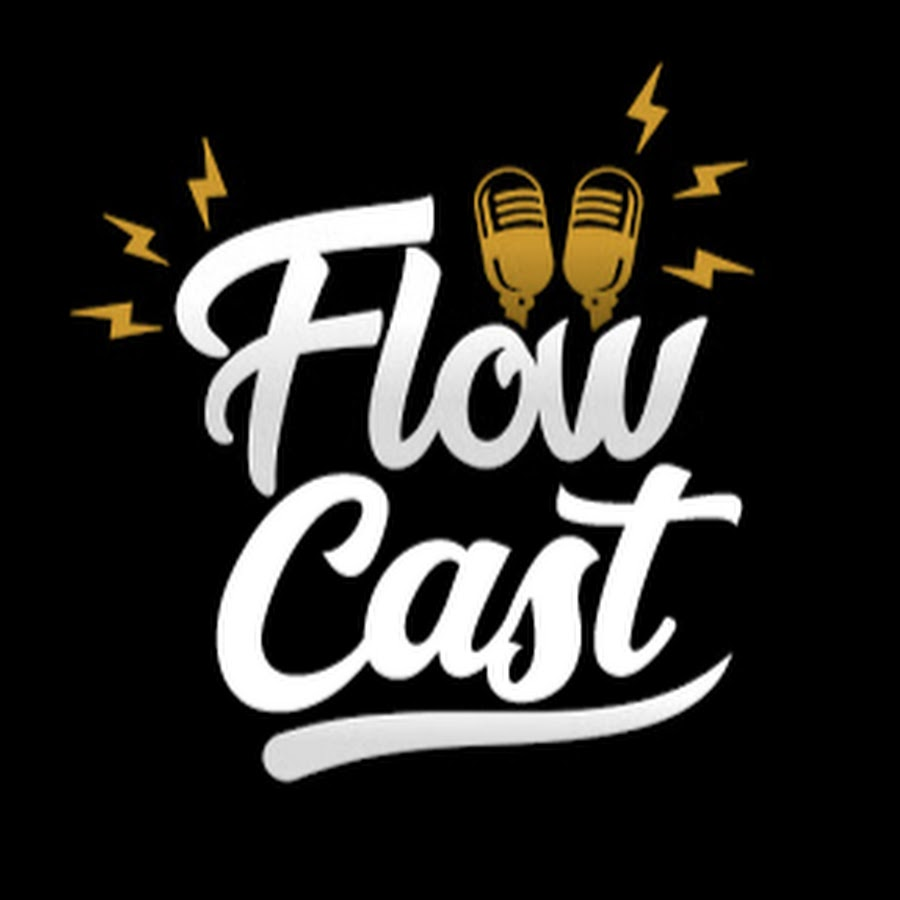

# 🎙️ Podcast Manager


<table>
        <tr>
            <td>
                
            </td>
            <td>
   <b><h2> 📌 Descrição </h2></b>
   <p>
O <b>Podcast Manager</b> é uma aplicação inspirada no estilo da Netflix, projetada para centralizar diferentes episódios de podcasts separados por categorias.  
O objetivo é facilitar o acesso e a organização de episódios em formato de vídeo, oferecendo uma navegação intuitiva e agradável para os usuários.
</p>
     </td>
        </tr>
    </table>


## 🏗️ Arquitetura do Projeto

O **Podcast Manager API** segue uma arquitetura simples baseada em **API REST**, organizada em camadas:

**1. Entrada da Requisição (Porta 3333)**

- O servidor Node.js fica escutando na porta 3333.
- As requisições HTTP chegam nesta porta (por exemplo: `GET /api/list` ou `GET /api/podcasts?p=flow`).

**2. Controlador (Podcast Controller)**

- Responsável por receber a requisição, validar parâmetros e acionar a lógica de negócio.
- Faz a consulta das informações de episódios.

**3. Fluxo de Comunicação**
- **Request:** o cliente (frontend ou ferramenta como Postman) envia a requisição para o controlador.
- **Processamento:** o controlador interpreta e organiza os dados de acordo com o endpoint solicitado.
- **Response:** a API retorna a resposta em formato JSON, contendo as informações solicitadas.


## 🚀 Funcionalidades
- **Listagem de episódios por categoria**  
  Organiza os episódios em categorias como *saúde*, *bodybuilder*, *economia* e *humor*, permitindo explorar facilmente o conteúdo disponível.
  
- **Filtro por nome do podcast**  
  Busca rápida por nome de podcast, facilitando encontrar episódios específicos.

---

## ⚙️ Implementação

### *️⃣ Listar episódios por categoria
**Endpoint:** `GET /api/list`  
**Descrição:** Retorna uma lista de episódios de podcasts organizados por categorias.  

**Exemplo de resposta:**
```json
[
  {
    "podcastName": "flow",
    "episode": "SÓ USAMOS 10% DO CÉREBRO? [Com Lucas Zanandrez do @olaciencia] - Flow #471",
    "videoId": "aGsBPwMYJUM",
    "categories": ["saúde", "bodybuilder"]
  },
  {
    "podcastName": "flow",
    "episode": "THIAGO NIGRO (PRIMO RICO) - Flow Podcast #353",
    "videoId": "LWzqlBHJ8wc",
    "categories": ["economia"]
  }
]
```

### *️⃣ Filtrar episódios por nome de podcast
- **Endpoint:** `GET /api/podcasts?p={nome}`
- **Descrição:** Retorna uma lista de episódios de podcast com base no nome do podcast fornecido.
- **Exemplo de requisição:** `GET /api/podcasts?p=flow`

## 🛠️ Tecnologias Utilizadas
- [**Node.js**](https://nodejs.org/) — Ambiente de execução JavaScript no lado do servidor.
- [**TypeScript**](https://www.typescriptlang.org/) — Superset do JavaScript que adiciona tipagem estática e recursos avançados.
- [**tsx**](https://github.com/esbuild-kit/tsx) — Executor rápido para TypeScript e JSX, sem necessidade de compilação prévia.
- [**tsup**](https://tsup.egoist.dev/) — Empacotador rápido para TypeScript/JavaScript.
- [**@types/node**](https://www.npmjs.com/package/@types/node) — Tipos TypeScript para o Node.js, garantindo autocompletar e verificação de tipos.

## 📂 Como Utilizar
1 - Clone este repositório:
```bash
git clone https://github.com/Jezebel1990/app-flow.git
```

2- Instale as dependências:
```bash
 npm install
 ```

3- Inicie o servidor em modo desenvolvimento
```bash
npm run start:dev
 ```

4- **Acesse os endpoints** para listar episódios ou filtrá-los:
- `GET /api/list`
- `GET /api/podcasts?p=nome-do-podcast`

---
Feito com ♥ por [Jezebel Guedes](https://www.linkedin.com/in/jezebel-guedes/) 👋 Entre em contato!